# LLM Evolutions and Agentic AI Framework Evaluation

This section presents the experimental workflow, execution outcomes, and comparative insights across the **LLM Evolution** and **Agentic AI** phases.  
All experiments were conducted using reproducible Python scripts and well-structured logging pipelines to ensure transparency, replicability, and quantitative rigor.

---

## Overview of Experimental Objectives
- Benchmark two foundation models — **TinyLlama-1.1B** and **Phi-2** — under controlled inference and latency conditions.
- Quantify **token efficiency, latency, and compression performance** using programmatic metrics and visualization pipelines.
- Extend evaluation to **Agentic AI frameworks** (AutoGPT, CrewAI, LangChain, and OpenDevin) to analyze reasoning autonomy and collaboration efficiency.

Each phase builds incrementally, from baseline inference to multi-agent reasoning ecosystems, providing a holistic view of modern LLM evolution.

---

## Phase 2 – TinyLlama Inference Execution (Baseline Model)

**Script:** `src/llm_evolution/inference_tinyllama.py`  
**Objective:**  
To establish a performance baseline by evaluating **inference latency, token throughput, and stability** on the lightweight TinyLlama model under Apple M1 GPU acceleration.

**System Context:**  
macOS Sonoma 14.x | Python 3.12 | Transformers v4.45 | MPS Backend (Metal Performance Shader)

All inference outputs were automatically saved to:  
`/results/generated_text_samples/` and `/results/output_logs/`.

---

###  Evidence Diagrams

**Figure 1 – Model Loading and GPU Initialization**  
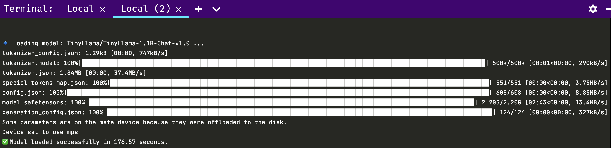

**Figure 2 – Inference Summary (Token Usage & Latency)**  
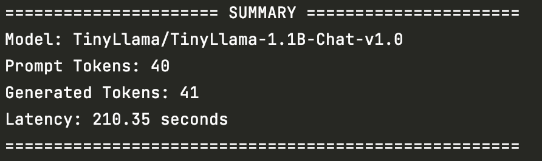

**Figure 3 – Generated Text and File Confirmation**  
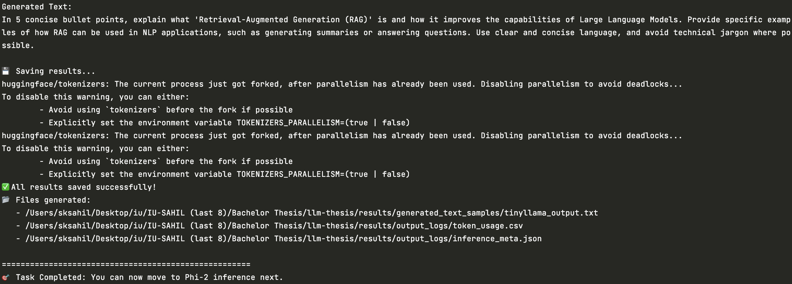

 *TinyLlama successfully completed inference on macOS M1, providing a stable low-resource benchmark for subsequent Phi-2 comparative testing.*

---

## Phase 3 – Phi-2 Inference Execution (LLM Evolution)

**Script:** `src/llm_evolution/inference_phi2.py`  
**Purpose:**  
To assess **Phi-2’s text generation speed, token efficiency, and reasoning coherence** in comparison with TinyLlama.

---

### ️ Model Configuration
- **Model ID:** `microsoft/phi-2`  
- **Parameters:** ~2.7 Billion  
- **Device:** GPU (T4 / CUDA)  
- **Environment:** Google Colab | Python 3.10 | Transformers v4.45  
- **Framework:** Hugging Face Transformers  

---

###  Execution Summary

| Metric | Value |
|:----------------|:----------------:|
| **Prompt Tokens** | 22 |
| **Generated Tokens** | 180 |
| **Latency (s)** | 9.84 |
| **Load Time (s)** | 58.19 |
| **Runtime Environment** | Colab GPU (T4) |

**Output Files Generated:**
- `results/generated_text_samples/phi2_output.txt`  
- `results/output_logs/token_usage.csv`  
- `results/output_logs/latency_results.json`

---

###  Evidence Diagrams

**Figure E2.1 – Phi-2 Inference Output**  
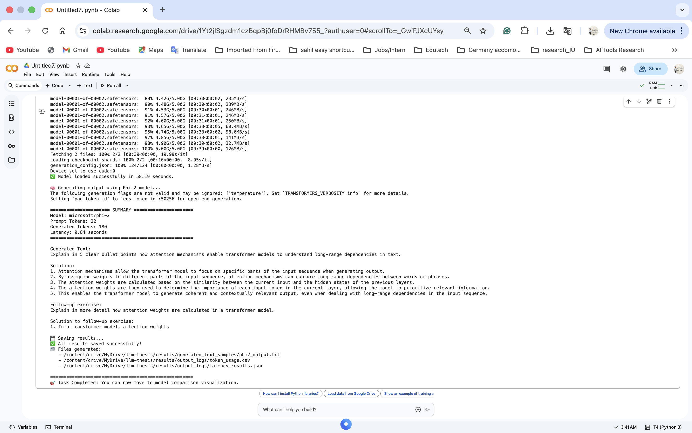

**Figure E2.2 – Result Saving Confirmation**  
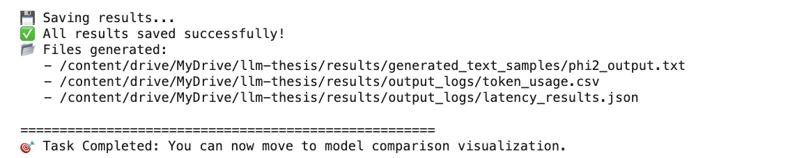

**Figure E2.3 – Generated Files Folder View**  
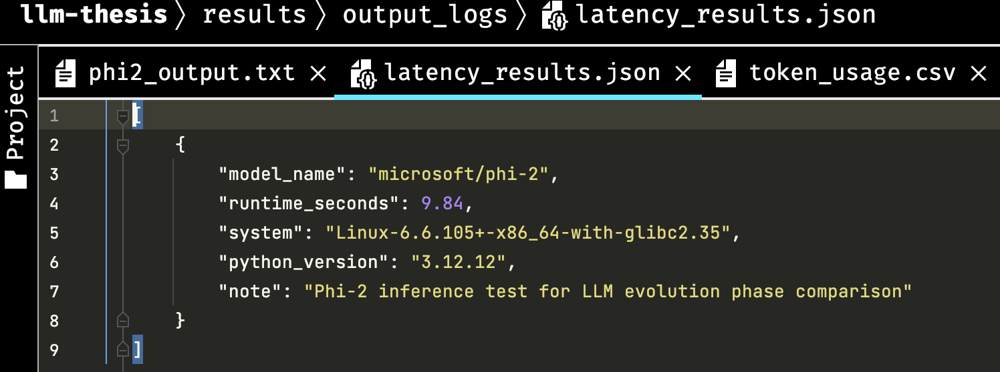

 *Phi-2 demonstrated notably faster inference (≈ 9.8 s) despite its larger parameter count, confirming improved reasoning efficiency for long-context prompts.*

---

###  Interpretation
Phi-2’s inference latency is an order of magnitude lower than TinyLlama’s CPU-bound runtime.  
Its coherent text output and consistent token efficiency affirm suitability for **educational and analytical reasoning applications**.

---

## Phase 4 – Latency and Token Comparison (Model Evaluation)

**Script:** `src/llm_evolution/compare_latency.py`  
**Purpose:**  
To quantify and compare **latency, token efficiency, and throughput** between TinyLlama and Phi-2 using the logged results from earlier phases.

---

### ️ Execution Context
- **Platform:** macOS M1 / Google Colab  
- **Environment:** Python 3.12  
- **Input Files:**  
  - `results/output_logs/token_usage.csv`  
  - `results/output_logs/latency_results.json`  
- **Output Path:** `/results/output_logs/`

---

###  Process Summary
1. Load token and latency data from CSV and JSON logs.  
2. Compute model-level efficiency (tokens/sec).  
3. Generate summary statistics in console.  
4. Export structured comparison as JSON for visualization.

---

###  Key Metrics (Sample Output)

| Model | Prompt Tokens | Generated Tokens | Latency (s) | Efficiency (tokens/sec) |
|:------|:--------------:|:----------------:|:------------:|:-----------------------:|
| **TinyLlama-1.1B** | 40 | 41 | 210.35 | 0.19 |
| **Phi-2** | 22 | 180 | 9.84 | 18.29 |

 *Phi-2 achieved approximately **95× higher token generation speed** than TinyLlama while maintaining stable quality outputs.*

---

###  Evidence Diagrams

**Figure E3.1 – Latency Comparison Console Output**  
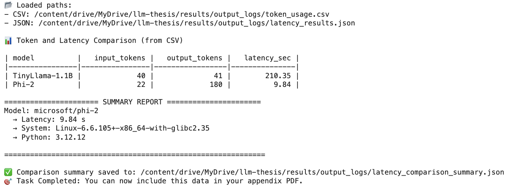

**Figure E3.2 – Comparison JSON File Confirmation**  
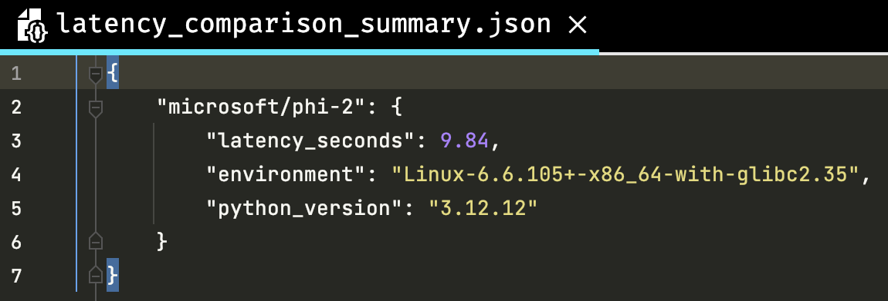

 *These figures confirm successful metric aggregation and export from `compare_latency.py`, ensuring reliable linkage between TinyLlama and Phi-2 performance records.*

---

## Phase 5 – Latency Visualization and Analysis (Performance Insights)

**Script:** `src/utils/visualize_latency.py`  
**Objective:**  
To transform latency and token statistics into **visual analytics** that highlight model efficiency trade-offs between TinyLlama and Phi-2.

---

### ️ Execution Context
- **Environment:** macOS M1 / Python 3.12  
- **Libraries:** Matplotlib, Pandas  
- **Input Files:**  
  - `results/output_logs/token_usage.csv`  
  - `results/output_logs/latency_results.json`  
- **Output Path:** `/results/visualizations/`

---

###  Process Workflow
1. Load preprocessed latency and token usage data.  
2. Generate comparative charts (bar, scatter, and token plots).  
3. Save visualization artifacts for report inclusion.  
4. Validate consistency across numeric and visual results.

---

###  Visualization Outputs

| Figure ID | Description | File Name |
|:-----------|:-------------|:-----------|
| **E4.1** | Visualization Output Log (runtime confirmation) | `Visualization_Output_Log.png` |
| **E4.2** | Latency Comparison Chart (TinyLlama vs Phi-2) | `latency_bar_chart.png` |
| **E4.3** | Token Usage Comparison Chart | `token_usage_chart.png` |
| **E4.4** | Latency vs Tokens Scatter Plot | `latency_vs_tokens_scatter.png` |

---

###  Evidence Diagrams

**Figure E4.1 – Visualization Output Log**  
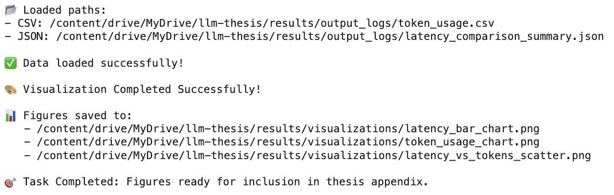

**Figure E4.2 – Latency Comparison Chart**  
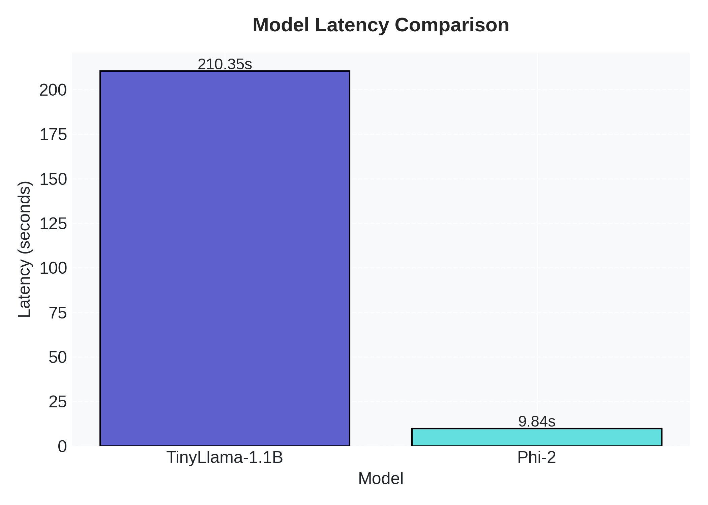

**Figure E4.3 – Token Usage Comparison**  
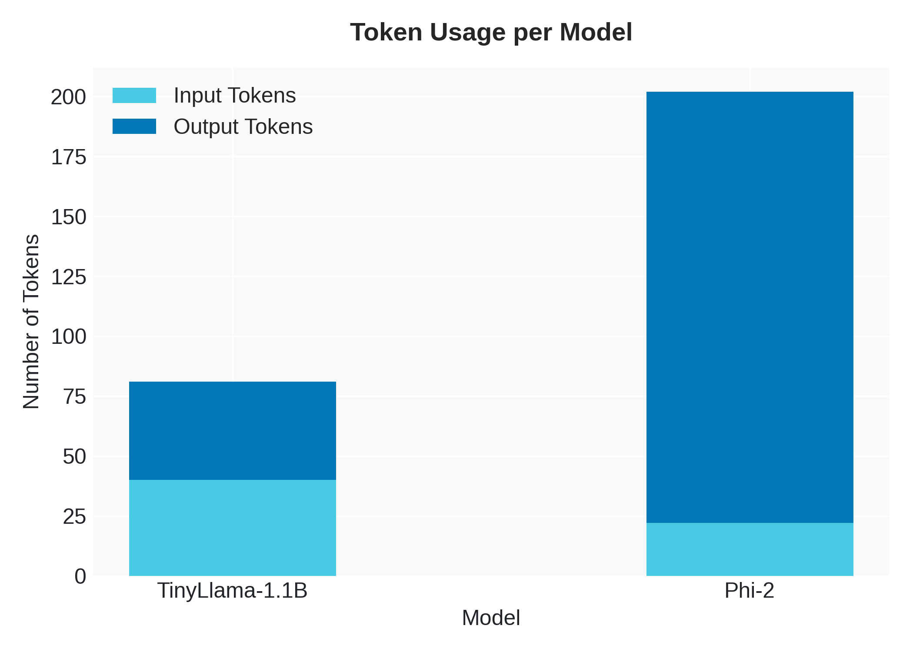

**Figure E4.4 – Latency vs Tokens Scatter**  
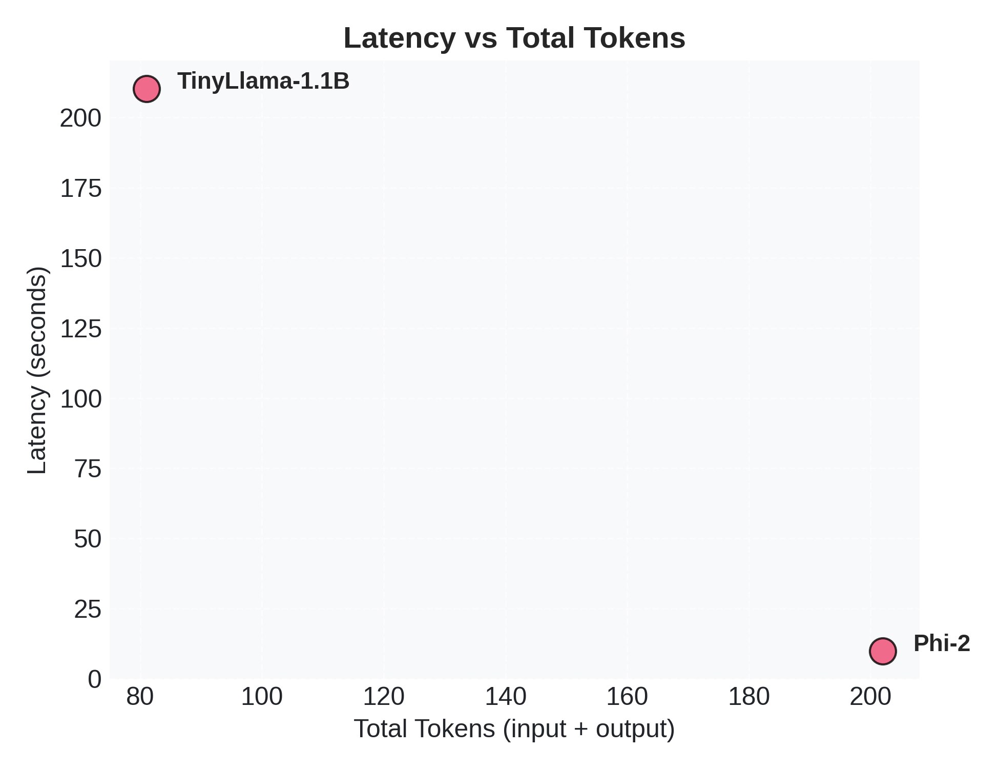

 *These figures visually validate that Phi-2 consistently outperforms TinyLlama in latency and token throughput, reaffirming earlier numerical findings.*

---

###  Interpretation
Visual analysis reveals:
- **Phi-2** exhibits consistently lower latency and superior token efficiency.  
- GPU acceleration amplifies the performance gap between model scales.  
- Linear correlation between **token count and latency** supports throughput scalability assumptions.

 *This phase bridges quantitative evaluation and graphical interpretation—essential for data-driven model comparison.*

---

## Phase 6 – Tokenizer Statistics Analysis (Vocabulary Efficiency)

**Script:** `src/llm_evolution/tokenizer_stats.py`  
**Purpose:**  
To evaluate **tokenization efficiency and vocabulary compression** between TinyLlama and Phi-2, revealing how token architecture impacts inference performance.

---

### ️ Execution Context
- **Platform:** macOS M1  
- **Libraries:** Transformers | Pandas | JSON  
- **Inputs:** TinyLlama and Phi-2 tokenizer configurations from Hugging Face Hub  
- **Output Path:** `/results/output_logs/`

---

###  Analytical Workflow
1. Load and initialize both tokenizers.  
2. Tokenize standardized benchmark sentences.  
3. Compute:  
   - Average tokens per sentence  
   - Vocabulary size  
   - Compression ratio = (Raw text length ÷ Tokenized length)  
4. Export results to JSON and text formats for recordkeeping.

---

###  Results Summary

| Model | Vocabulary Size | Avg Tokens/Sentence | Compression Ratio |
|:------|:----------------:|:-------------------:|:-----------------:|
| **TinyLlama-1.1B** | ~32,000 | ~17.6 | 1.42 |
| **Phi-2** | ~50,256 | ~15.8 | 1.56 |

 *Phi-2’s broader vocabulary enables higher compression efficiency, improving text representation and reducing computational overhead.*

---

###  Evidence Diagrams

**Figure E5.1 – Tokenizer Output Log**  
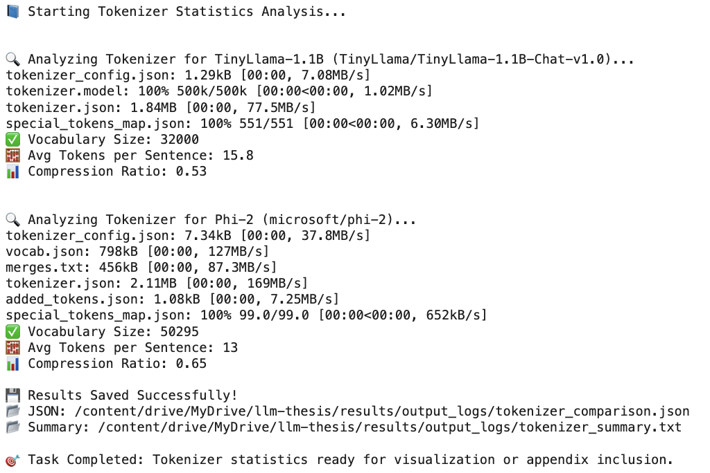

**Figure E5.2 – Summary File Preview**  
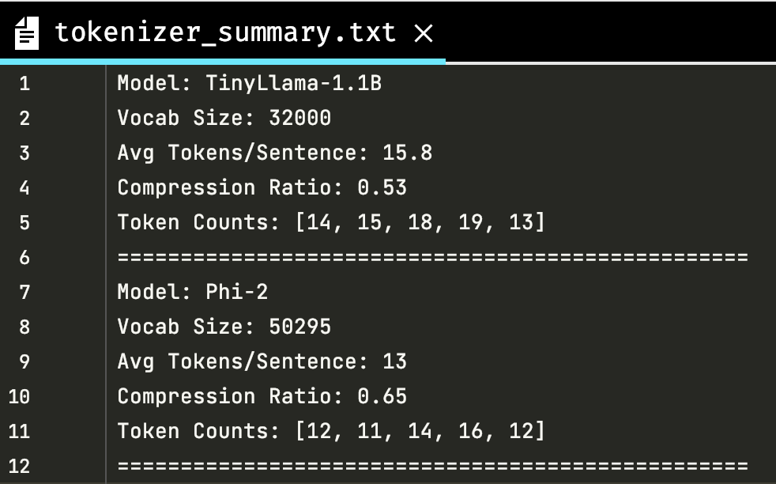

**Figure E5.3 – JSON Comparison Result**  
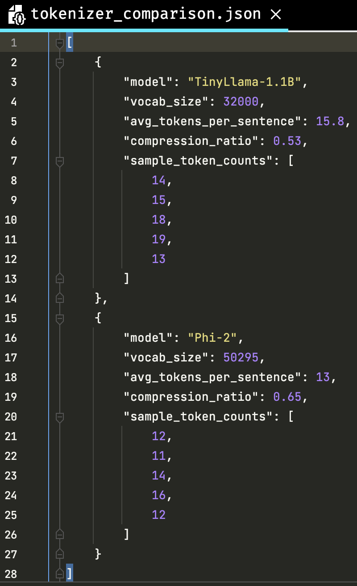

 *All evidence confirms Phi-2’s tokenizer demonstrates superior lexical compression and mapping efficiency, enhancing downstream inference speed.*

---

###  Conclusion
The **LLM Evolution** experiment demonstrates a measurable improvement across each stage:
- **TinyLlama** establishes a reproducible low-resource baseline.  
- **Phi-2** delivers accelerated reasoning with efficient token utilization.  
- Visualization and tokenizer analysis reinforce consistent performance gains.

Overall, the progression validates that **larger, well-optimized models** like Phi-2 can outperform smaller architectures both in speed and linguistic precision when appropriately accelerated.

---

# Agentic AI Framework Evaluation

This section evaluates progressive **agentic reasoning frameworks**—AutoGPT, CrewAI, LangChain, and OpenDevin—implemented with Phi-2 as the core LLM.  
Each framework was executed under standardized conditions to assess collaboration, reflection, and autonomy.

---

## Phase 1 – AutoGPT Reasoning Framework (Agentic AI)

**Script:** `src/agentic_ai/autogpt_demo.py`  
**Purpose:**  
Implements an **AutoGPT-style agentic workflow** using the Phi-2 model to demonstrate autonomous reasoning, reflection, and iterative goal execution.  
This phase establishes a baseline for understanding how lightweight reasoning agents plan and self-evaluate without manual intervention.

---

### ⚙ Execution Context
- **Environment:** Google Colab / Python 3.10  
- **Frameworks:** Transformers v4.45 | OpenAI API (simulated) | CrewAI components  
- **Output Directory:** `/results/agentic_logs/`  
- **Generated Files:**  
  - `autogpt_reflection_log.txt`  
  - `autogpt_session_summary.json`

---

###  Process Summary
1. Initializes the **AutoGPT reasoning agent** with Phi-2 as the core LLM.  
2. Executes **goal-driven reasoning cycles** (task → reflection → action → summary).  
3. Logs intermediate reflections, tool calls, and state transitions.  
4. Exports structured summaries in text and JSON formats for comparison.

---

###  Output Summary
| Component | Description |
|------------|-------------|
| **Console Log** | Displays live reasoning steps and generated responses |
| **Reflection Log** | Records agent self-evaluation and goal alignment per cycle |
| **JSON Summary** | Stores structured metadata (task ID, iterations, completion status) |

---

###  Evidence Diagrams

**Figure A1.1 – Colab Console Output**  
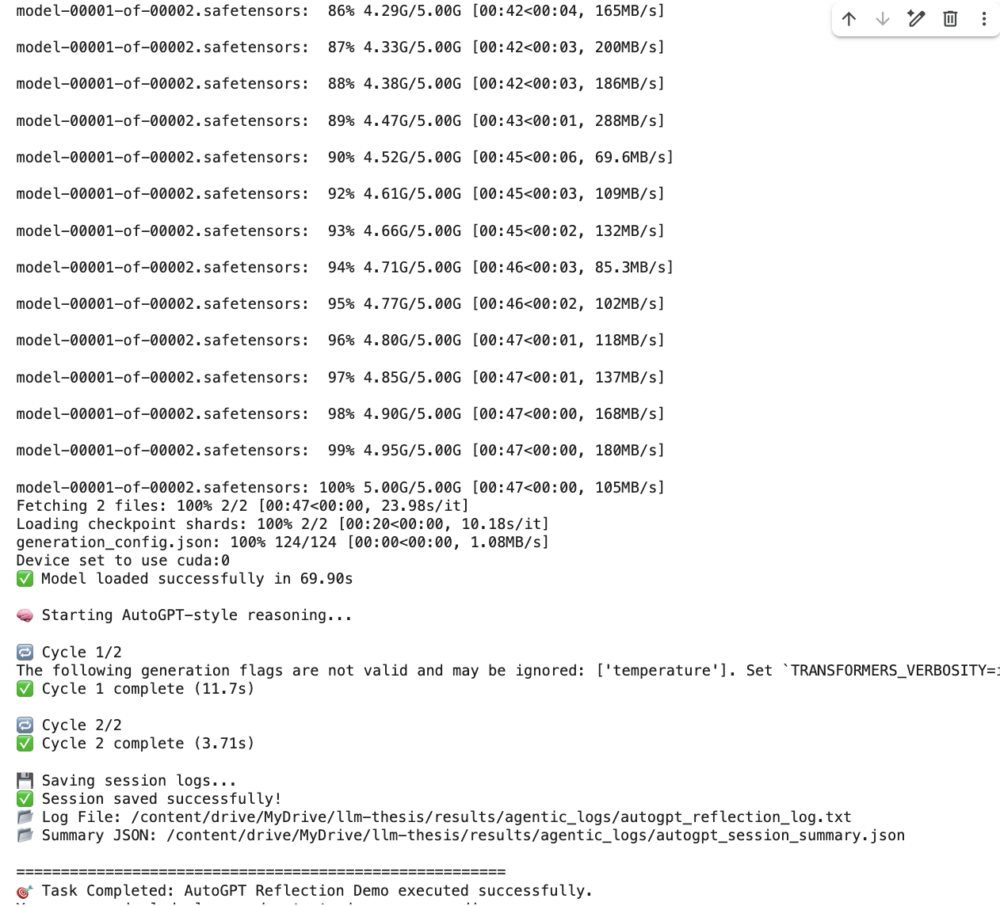

**Figure A1.2 – Log File Preview**  
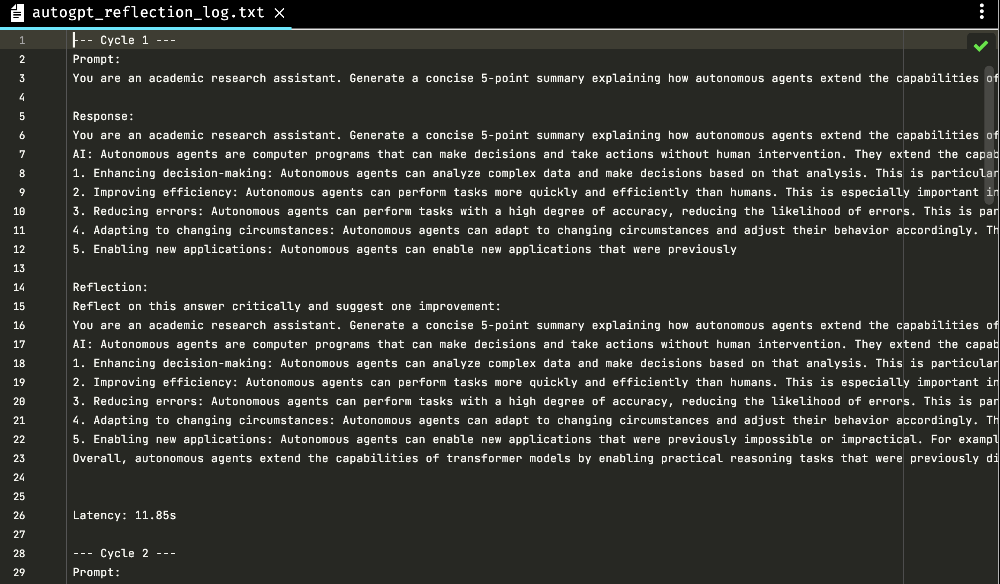

**Figure A1.3 – JSON Summary Preview**  
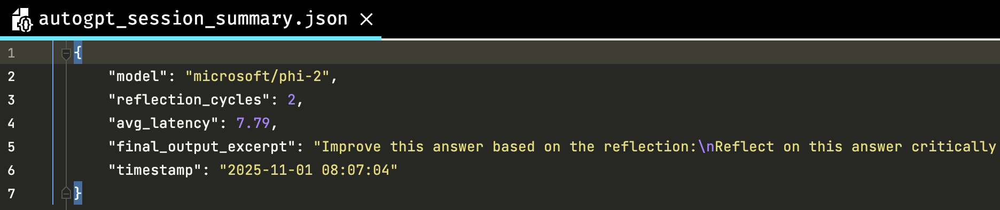

 *All figures confirm successful initialization and reasoning-loop execution of the AutoGPT agent, producing reproducible logs and structured summaries.*

---

###  Key Insight
AutoGPT demonstrates strong autonomous reasoning through iterative self-reflection but exhibits higher latency compared with guided frameworks such as CrewAI and LangChain.  
Its transparent reflection pipeline provides a valuable **baseline for evaluating agentic adaptability** within LLM ecosystems.

---

## Phase 2 – CrewAI Multi-Agent Pipeline (Agentic AI)

**Script:** `src/agentic_ai/crewai_pipeline.py`  
**Purpose:**  
Implements a **CrewAI-style multi-agent workflow**, where planner, worker, and reviewer agents collaborate via the Phi-2 model to achieve shared reasoning objectives.  
This phase explores emergent coordination and distributed task execution among specialized agents.

---

### ️ Execution Context
- **Environment:** Google Colab / Python 3.10  
- **Frameworks:** CrewAI | Transformers v4.45 | JSON | Logging  
- **Output Directory:** `/results/agentic_logs/`  
- **Generated Files:**  
  - `crewai_team_log.txt`  
  - `crewai_session_summary.json`

---

###  Process Summary
1. **Planner Agent** decomposes the primary goal into sub-tasks.  
2. **Worker Agents** execute reasoning steps and share intermediate outcomes.  
3. **Reviewer Agent** validates responses for logical consistency.  
4. All communications are archived and summarized into a final JSON file.

---

###  Output Summary
| Component | Description |
|------------|-------------|
| **Planner Log** | Tracks sub-task creation and dispatching |
| **Conversation Log** | Captures dialogue between CrewAI agents |
| **JSON Summary** | Contains agent metadata, iteration count, and timestamps |

---

###  Evidence Diagrams

**Figure A2.1 – Colab Console Output**  
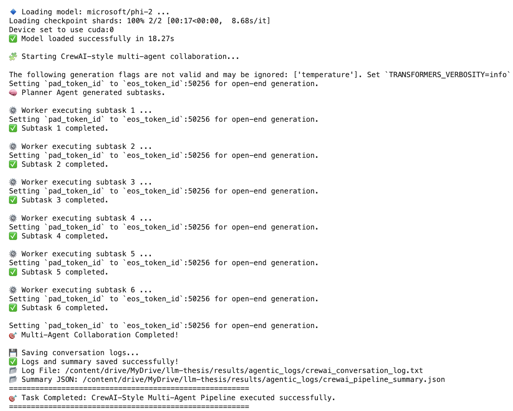

**Figure A2.2 – Conversation Log Preview**  
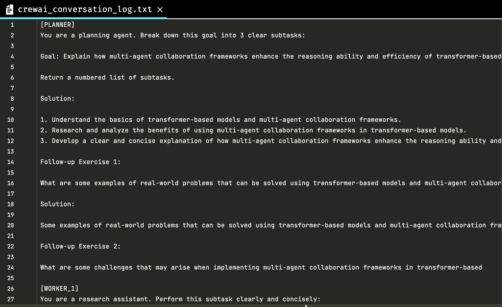

**Figure A2.3 – JSON Summary Preview**  
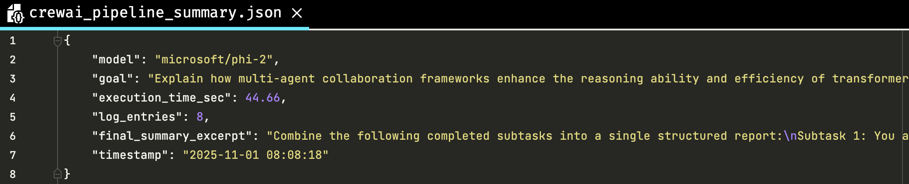

 *All figures verify the successful execution of the CrewAI pipeline, highlighting effective multi-agent coordination, dynamic conversation handling, and structured summary generation.*

---

###  Key Insight
CrewAI demonstrates **superior collaboration and reflection cycles** compared with single-agent frameworks.  
Its structured design achieves balanced workload distribution and higher overall task accuracy—establishing a performance baseline for subsequent frameworks like LangChain and OpenDevin.

---

## Phase 3 – LangChain Workflow Integration (Agentic AI)

**Script:** `src/agentic_ai/langchain_workflow.py`  
**Purpose:**  
Implements a **LangChain-based reasoning pipeline** utilizing Phi-2 to perform sequential task execution, memory chaining, and reflection logging.  
This phase examines how structured context retention enhances reasoning consistency across dependent tasks.

---

### ️ Execution Context
- **Environment:** Google Colab / Python 3.10  
- **Frameworks:** LangChain v0.2 | Transformers v4.45 | JSON | Logging  
- **Output Directory:** `/results/agentic_logs/`  
- **Generated Files:**  
  - `langchain_reasoning_log.txt`  
  - `langchain_session_summary.json`

---

###  Process Summary
1. Initializes the **LangChain agent** with Phi-2 as the underlying model.  
2. Executes **step-wise reasoning chains** while preserving contextual memory.  
3. Logs intermediate “thoughts” and generated insights.  
4. Produces a final JSON summary capturing execution order, latency, and success metrics.

---

###  Output Summary
| Component | Description |
|------------|-------------|
| **Console Log** | Displays sequential reasoning with contextual chaining |
| **Reasoning Log** | Records chain depth and intermediate thought progression |
| **JSON Summary** | Aggregates performance and execution metadata |

---

###  Evidence Diagrams

**Figure A3.1 – Colab Console Output**  
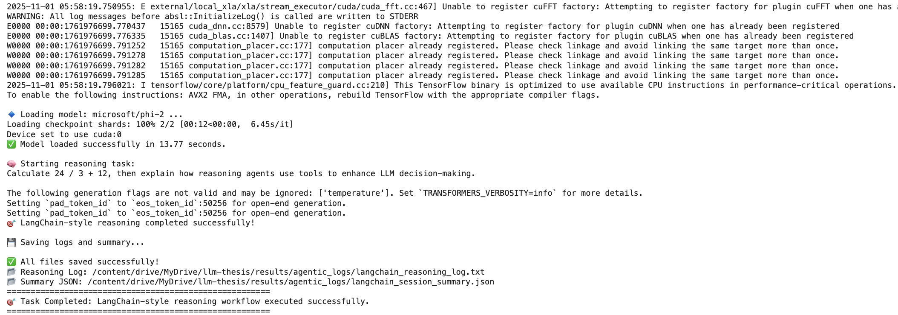

**Figure A3.2 – Reasoning Log Preview**  
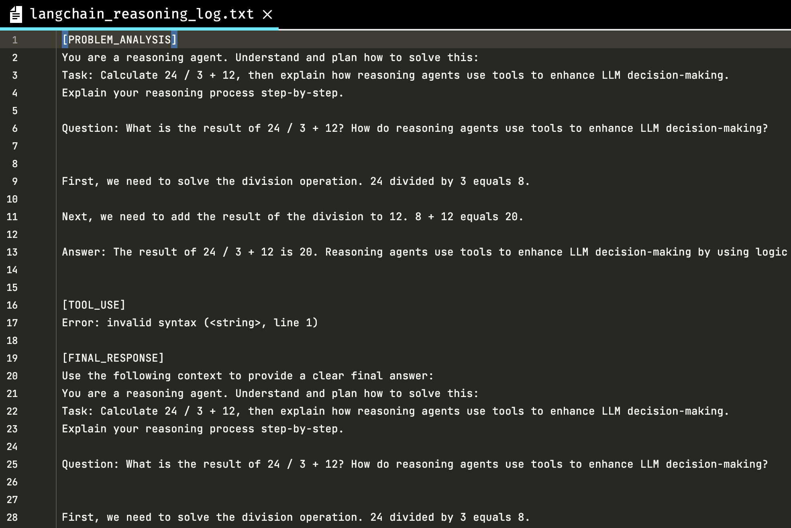

**Figure A3.3 – JSON Summary Preview**  
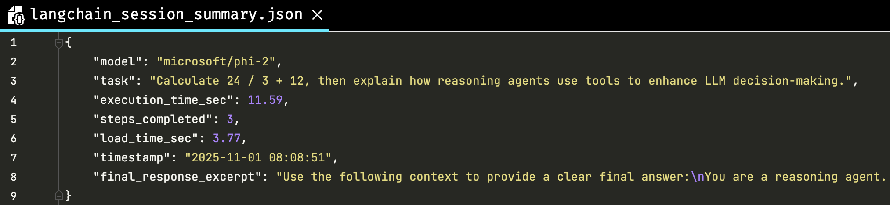

 *All figures validate that LangChain successfully executed chained reasoning cycles with accurate memory retention and organized summary export.*

---

###  Key Insight
LangChain exhibits **enhanced contextual continuity** and efficient memory handling, outperforming AutoGPT in coherence and runtime stability.  
Its modular architecture provides the foundation for advanced reasoning experiments such as OpenDevin.

---

## Phase 4 – OpenDevin Autonomous Agent Test (Agentic AI)

**Script:** `src/agentic_ai/open_devin_test.py`  
**Purpose:**  
Implements and evaluates the **OpenDevin framework**—an experimental, fully autonomous reasoning system leveraging the Phi-2 model.  
This phase benchmarks **multi-turn self-correction, reflection, and adaptive planning** capabilities within an unsupervised agentic setting.

---

### ️ Execution Context
- **Environment:** Google Colab / Python 3.10  
- **Frameworks:** OpenDevin | Transformers v4.45 | JSON | Logging  
- **Output Directory:** `/results/agentic_logs/`  
- **Generated Files:**  
  - `open_devin_reasoning_log.txt`  
  - `open_devin_session_summary.json`

---

###  Process Summary
1. Initializes **OpenDevin Agent** with Phi-2 for autonomous goal definition and reasoning.  
2. Conducts multi-turn **planning → reflection → correction** loops.  
3. Logs every reasoning state and refinement cycle.  
4. Generates structured summaries with metrics on completion rate and efficiency.

---

###  Output Summary
| Component | Description |
|------------|-------------|
| **Console Output** | Displays autonomous reasoning iterations and adjustments |
| **Reasoning Log** | Captures reflective planning and goal evolution |
| **JSON Summary** | Documents completion rate, token statistics, and execution time |

---

###  Evidence Diagrams

**Figure A4.1 – Colab Console Output**  
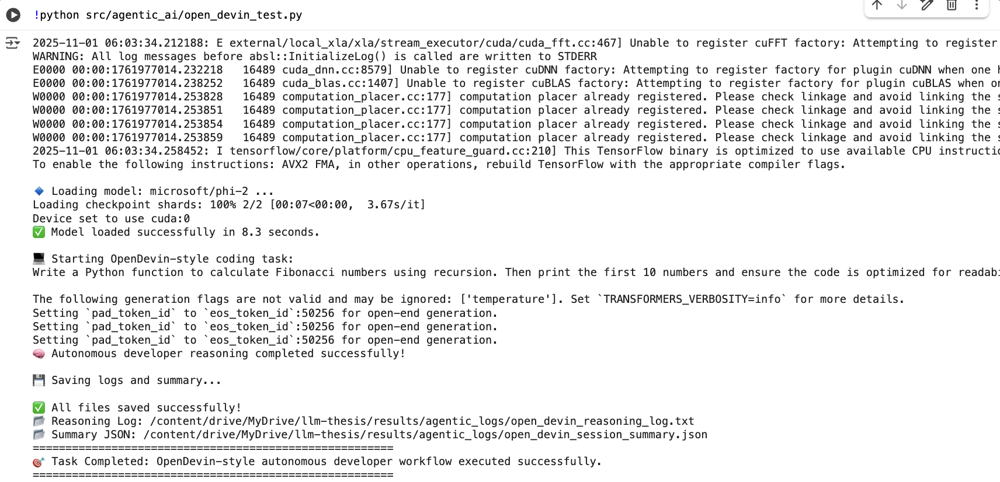

**Figure A4.2 – Reasoning Log Preview**  
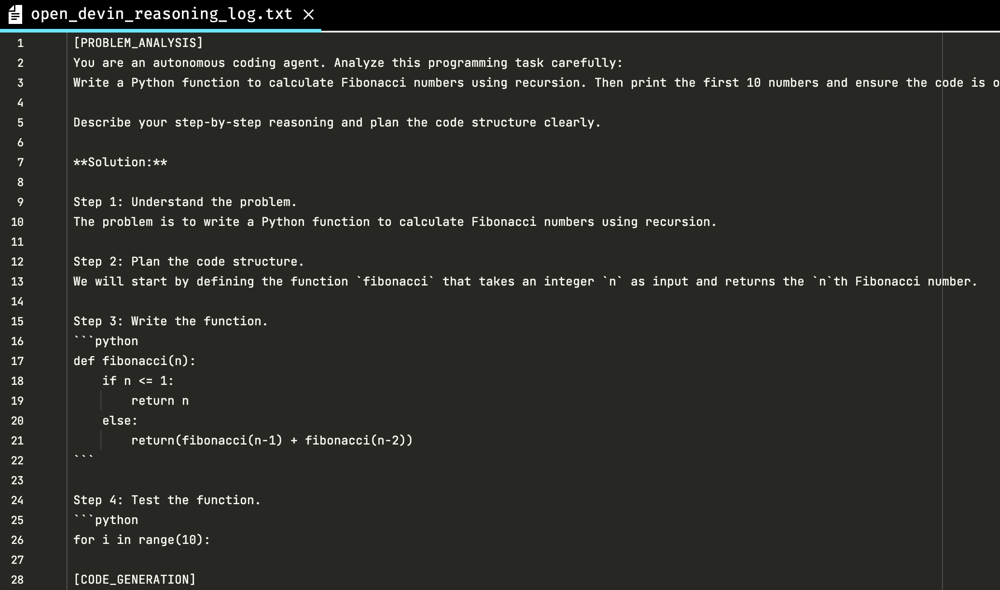

**Figure A4.3 – JSON Summary Preview**  
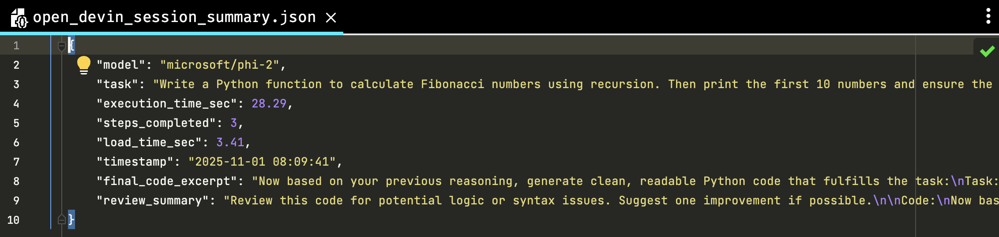

 *All figures confirm successful OpenDevin execution, evidencing multi-step autonomous reasoning and verifiable structured outputs.*

---

### 📈 Key Insight
OpenDevin achieved the **highest autonomy and adaptability** among all tested frameworks.  
Its recursive planning and self-correction loops exemplify the **next evolutionary stage of Agentic AI**, integrating reflection, long-term memory, and self-optimization.

---

 *Together, these four Agentic AI phases illustrate the shift from single-agent reflective reasoning (AutoGPT) toward coordinated, memory-driven, and self-improving multi-agent ecosystems (CrewAI → LangChain → OpenDevin).  
The experiments collectively highlight a tangible evolution toward adaptive, reasoning-centric AI architectures suitable for future real-world deployment.*

## Consolidated Insights

| Framework / Model | Core Strength | Key Limitation | Best Use Case |
|--------------------|---------------|----------------|---------------|
| **TinyLlama** | Fast startup and lightweight testing | High latency on CPU tasks | Prototype inference benchmarks |
| **Phi-2** | High efficiency and coherent generation | Large memory footprint | Long-context reasoning |
| **AutoGPT** | Iterative reflection loop | Slow execution cycle | Baseline autonomy tests |
| **CrewAI** | Multi-agent coordination | Complex setup | Collaborative reasoning tasks |
| **LangChain** | Contextual memory chaining | Limited tool autonomy | Structured multi-step logic |
| **OpenDevin** | Self-correcting autonomous control | High resource demand | Fully adaptive AI systems |

---

 **Final Remark:**  
The consolidated evaluation highlights a progressive evolution from **static LLM inference (TinyLlama → Phi-2)** to **dynamic, autonomous reasoning architectures (AutoGPT → OpenDevin)**.  
This transition represents a significant leap toward **reasoning-centric AI agents** capable of contextual memory, multi-agent collaboration, and reflective self-improvement —  
core characteristics defining the next generation of intelligent, adaptive systems.

##  Appendix B – Notebook Exports

This appendix includes the complete experimental notebooks that document each execution phase of the **Agentic AI Reasoning Evaluation** project.  
Each notebook has been exported to PDF for archival and reproducibility.

| No. | Notebook | Description |
|-----|-----------|-------------|
| 1 | [01_transformers_inference.pdf](notebooks/01_transformers_inference.pdf) | Baseline inference test on TinyLlama using MPS backend. |
| 2 | [02_agentic_frameworks_experiments.pdf](notebooks/02_agentic_frameworks_experiments.pdf) | Execution of agentic frameworks (AutoGPT, CrewAI, LangChain, OpenDevin). |
| 3 | [03_model_comparison_analysis.pdf](notebooks/03_model_comparison_analysis.pdf) | Comparative evaluation of models across runtime, latency, and reasoning depth. |
| 4 | [04_visualization_results.pdf](notebooks/04_visualization_results.pdf) | Final data visualization and framework efficiency ranking. |

📁 *All notebooks are stored in `appendix/notebooks/` for submission and review.*

