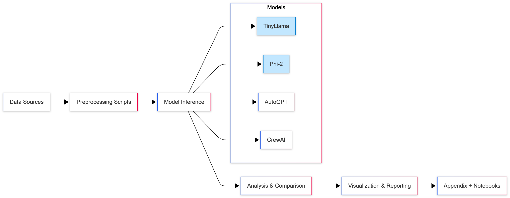
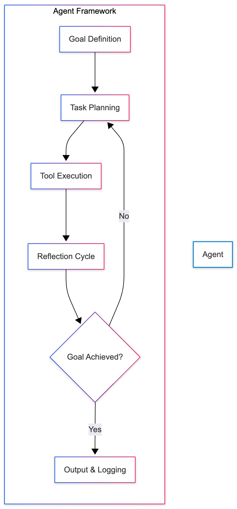
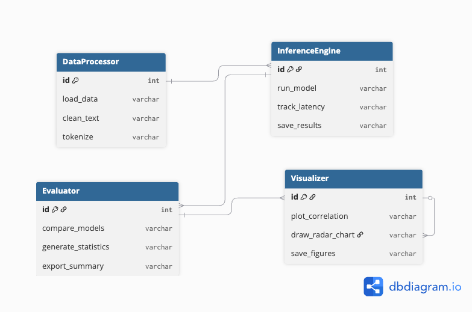

#  Methodology Overview

This project follows a **data-driven experimental methodology** for evaluating agentic frameworks.

1️⃣ **Model Inference Phase**
   - Execute Transformer and Agentic models (TinyLlama, Phi-2, AutoGPT, etc.)
   - Collect runtime, token usage, and latency data

2️⃣ **Analytical Phase**
   - Aggregate metrics and compute comparative statistics
   - Generate correlation and ranking visualizations

3️⃣ **Visualization Phase**
   - Create bar charts, radar plots, and efficiency scores
   - Export summaries for reproducibility

---

**Figure 1:**   
**Figure 2:**   
**Figure 3:** 
